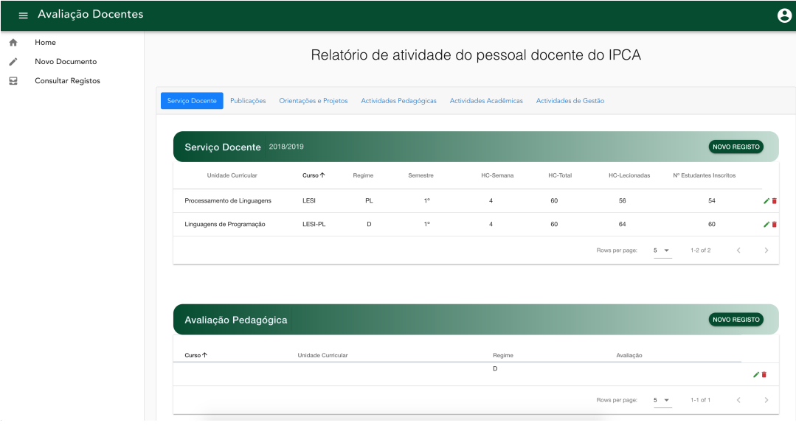

# RAD

Guested teachers of Instituto Politecnico do C´avado e do Ave have to submit a yealier report
every civil year, regarding their scientific activity, academic and management. They have also need
to add proof of each activity through the addition of a PDF document.

The goal is to create a digital solution que allows to the Evaluated teacher’s, insert all the
information relative to their annual registry, as also, allowing to the evaluator consult each one
of the registries and make an evaluation.

To realize this digital transformation, an WebApp was developed, that allows the user
authentication and, according to the type of the user (Evaluator or Evaluated), allows a consult,
or insertion of a new registry. It was clear that this application should be complete, and also
allow some type of flexibility if a change on the form was needed in the future, giving some
space for future improvements.

The Evaluator, can also authenticate, and when done with success allow him to consult all
the documents for evaluation, as also download the PDF files attached.

## Photos

### Login


### Evalutator - Choose form


### Evaluator - Edit form



### Evaluator - Edit form (different tab)


### Evaluator - Text box


## How to start project

on / directory ```npm install``` to install all dependencies from package json.

From /client enter ```npm run start```.

From /server enter ```nodemon```.


Mongo Database is located on remote server